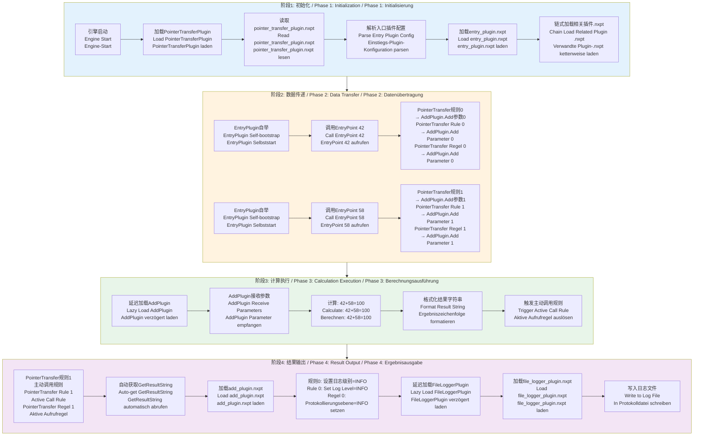

# NXLD 链式加载流程文档 / Chain Loading Workflow Documentation / Kettenladungs-Workflow-Dokumentation

本文档描述了重构后的 NXLD 指针传递插件的链式加载机制和完整工作流程。
This document describes the chain loading mechanism and complete workflow of the refactored NXLD pointer transfer plugin.
Dieses Dokument beschreibt den Kettenladungsmechanismus und den vollständigen Workflow des refactorierten NXLD-Zeigerübertragungs-Plugins.

## 架构设计 / Architecture Design / Architektur-Design

### 核心原则 / Core Principles / Kernprinzipien

1. **去中心化配置 / Decentralized Configuration / Dezentralisierte Konfiguration**
   - 每个插件拥有自己的 `.nxpt` 配置文件 / Each plugin has its own `.nxpt` configuration file / Jedes Plugin hat seine eigene `.nxpt`-Konfigurationsdatei
   - 配置规则分散在各个插件的配置文件中 / Configuration rules are distributed across plugin configuration files / Konfigurationsregeln sind über Plugin-Konfigurationsdateien verteilt

2. **链式加载机制 / Chain Loading Mechanism / Kettenladungsmechanismus**
   - PointerTransferPlugin 启动时只加载入口插件的 `.nxpt` 文件 / PointerTransferPlugin only loads entry plugin's `.nxpt` file on startup / PointerTransferPlugin lädt beim Start nur die `.nxpt`-Datei des Einstiegs-Plugins
   - 根据入口插件的规则链式加载其他插件的 `.nxpt` 文件 / Chain load other plugins' `.nxpt` files according to entry plugin's rules / Kettenweise andere Plugins' `.nxpt`-Dateien gemäß Einstiegs-Plugin-Regeln laden

3. **延迟加载插件 / Lazy Plugin Loading / Lazy Plugin-Ladung**
   - 插件只在需要时加载，而非在加载 `.nxpt` 时加载 / Plugins are loaded only when needed, not when loading `.nxpt` / Plugins werden nur bei Bedarf geladen, nicht beim Laden von `.nxpt`
   - 根据条件传递暂缓启动，只在实际传递时进行启动插件 / Defer plugin startup based on transfer conditions, only start plugins during actual transfer / Plugin-Start basierend auf Übertragungsbedingungen verzögern, Plugins nur bei tatsächlicher Übertragung starten

## 完整工作流程 / Complete Workflow / Vollständiger Workflow



## 配置文件结构 / Configuration File Structure / Konfigurationsdatei-Struktur

### pointer_transfer_plugin.nxpt
```ini
[EntryPlugin]
PluginName=EntryPlugin
PluginPath=./plugins/entry_plugin.dll
NxptPath=./plugins/entry_plugin.nxpt
```

### entry_plugin.nxpt
包含从 EntryPlugin 到其他插件的传递规则：
- TransferRule_0: EntryPlugin.EntryPoint[0] → AddPlugin.Add[0]
- TransferRule_1: EntryPlugin.EntryPoint[0] → AddPlugin.Add[1]
- TransferRule_2: EntryPlugin.EntryPoint[0] → FileLoggerPlugin.Write[1]
- TransferRule_3: FileLoggerPlugin.Write[0] = 2 (常量值)

### add_plugin.nxpt
包含从 AddPlugin 到其他插件的传递规则：
- TransferRule_0: AddPlugin.GetResultString[0] → FileLoggerPlugin.Write[1] (条件: not_null)
- TransferRule_1: AddPlugin.Add (主动调用规则) → FileLoggerPlugin.Write[1]

### file_logger_plugin.nxpt
包含 FileLoggerPlugin 的配置规则：
- TransferRule_0: FileLoggerPlugin.Write[0] = 2 (常量值)

## 链式加载流程 / Chain Loading Flow / Kettenladungsfluss

1. **启动阶段 / Startup Phase / Startphase**
   - PointerTransferPlugin 加载自己的 `.nxpt` 文件
   - 解析入口插件配置，获取入口插件路径和 `.nxpt` 路径
   - 加载入口插件的 `.nxpt` 文件

2. **链式加载阶段 / Chain Loading Phase / Kettenladungsphase**
   - 遍历入口插件 `.nxpt` 中的所有规则
   - 对于每个规则的目标插件，检查其 `.nxpt` 文件是否已加载
   - 如果未加载，则根据插件路径构建 `.nxpt` 路径并加载
   - 递归处理新加载的规则中的目标插件

3. **延迟加载阶段 / Lazy Loading Phase / Lazy-Ladungsphase**
   - 当需要调用目标插件接口时，检查该插件的 `.nxpt` 文件是否已加载
   - 如果未加载，则先加载其 `.nxpt` 文件
   - 然后加载插件本身并调用接口

## 优势 / Advantages / Vorteile

1. **模块化 / Modularity / Modularität**
   - 每个插件管理自己的配置规则，便于维护 / Each plugin manages its own configuration rules, easy to maintain / Jedes Plugin verwaltet seine eigenen Konfigurationsregeln, einfach zu warten

2. **可扩展性 / Scalability / Skalierbarkeit**
   - 添加新插件只需创建对应的 `.nxpt` 文件 / Adding new plugins only requires creating corresponding `.nxpt` file / Hinzufügen neuer Plugins erfordert nur das Erstellen der entsprechenden `.nxpt`-Datei

3. **性能优化 / Performance Optimization / Leistungsoptimierung**
   - 延迟加载机制减少启动时间 / Lazy loading mechanism reduces startup time / Lazy-Ladungsmechanismus reduziert Startzeit
   - 只加载实际使用的插件 / Only load actually used plugins / Nur tatsächlich verwendete Plugins laden

4. **解耦设计 / Decoupling Design / Entkopplungsdesign**
   - 插件之间通过配置文件解耦 / Plugins are decoupled through configuration files / Plugins sind über Konfigurationsdateien entkoppelt
   - 修改一个插件的配置不影响其他插件 / Modifying one plugin's configuration doesn't affect other plugins / Änderung der Konfiguration eines Plugins beeinflusst andere Plugins nicht

