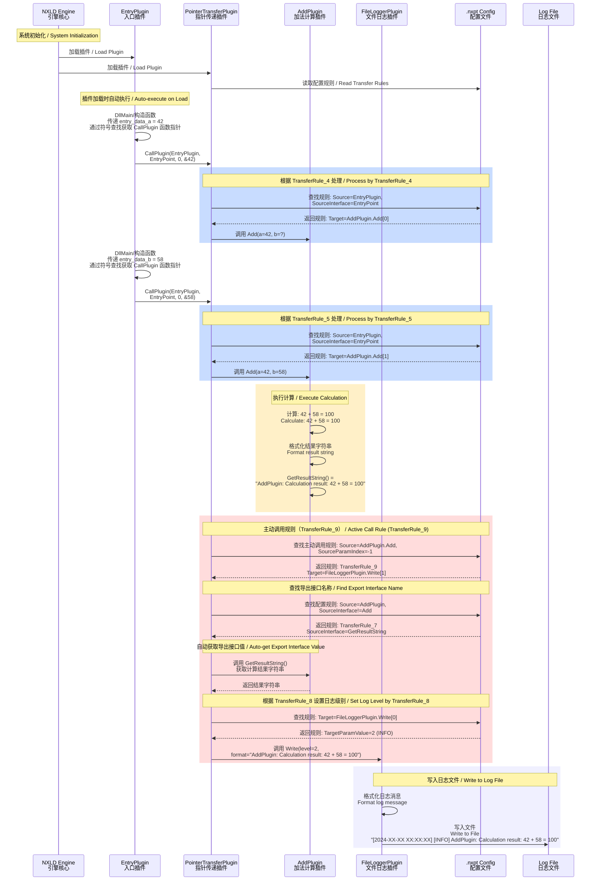

# NXLD 计算流程示例图 / Calculation Workflow Diagram / Berechnungsworkflow-Diagramm

**项目仓库 / Project Repository / Projekt-Repository:** [https://github.com/Qhunliv13/Nexusexample](https://github.com/Qhunliv13/Nexusexample)

本文档描述了完整的插件计算流程示例，展示了从 EntryPlugin 到 FileLoggerPlugin 的完整数据流转过程。
This document describes a complete plugin calculation workflow example, showing the complete data flow process from EntryPlugin to FileLoggerPlugin.
Dieses Dokument beschreibt ein vollständiges Plugin-Berechnungsworkflow-Beispiel und zeigt den vollständigen Datenflussprozess vom EntryPlugin zum FileLoggerPlugin.

## 完整计算流程 / Complete Calculation Workflow / Vollständiger Berechnungsworkflow

### 序列图 / Sequence Diagram / Sequenzdiagramm



### 流程图 / Flow Chart / Flussdiagramm

```mermaid
flowchart TD
    Start([系统启动<br/>System Start]) --> Load1[加载 EntryPlugin]
    Load1 --> Load2[加载 PointerTransferPlugin]
    Load2 --> Load3[加载配置文件 .nxpt]
    
    Load3 --> Init[系统初始化完成]
    
    Init --> Auto1[EntryPlugin 自动调用<br/>EntryPoint with 42<br/>通过符号查找获取 CallPlugin]
    Auto1 --> Rule4{查找配置规则<br/>TransferRule_4}
    
    Rule4 -->|Source: EntryPlugin.EntryPoint<br/>Target: AddPlugin.Add参数0| Store1[存储参数 a = 42]
    
    Store1 --> Auto2[EntryPlugin 自动调用<br/>EntryPoint with 58<br/>通过符号查找获取 CallPlugin]
    Auto2 --> Rule5{查找配置规则<br/>TransferRule_5}
    
    Rule5 -->|Source: EntryPlugin.EntryPoint<br/>Target: AddPlugin.Add参数1| Store2[存储参数 b = 58]
    
    Store2 --> Check1{检查参数是否完整?}
    
    Check1 -->|是| CallAdd[调用 AddPlugin.Add 42, 58]
    
    CallAdd --> Calc[AddPlugin 执行计算<br/>42 + 58 = 100]
    
    Calc --> Format[格式化结果字符串<br/>GetResultString]
    
    Format --> Rule9{查找主动调用规则<br/>TransferRule_9<br/>SourceParamIndex=-1}
    
    Rule9 -->|Source: AddPlugin.Add<br/>Target: FileLoggerPlugin.Write参数1| GetExport[自动获取导出接口值<br/>GetResultString]
    
    GetExport --> Rule8{查找配置规则<br/>TransferRule_8}
    
    Rule8 -->|Target: FileLoggerPlugin.Write参数0<br/>Value: 2 INFO| CallLogger[调用 FileLoggerPlugin.Write<br/>level=2, format=result_string]
    
    CallLogger --> Write[写入日志文件<br/>nxld_parser.log]
    
    Write --> End([流程完成<br/>Process Complete])
    
    Check1 -->|否| Wait[等待更多参数]
    Wait --> Auto2
    
    style Start fill:#90EE90
    style End fill:#FFB6C1
    style Calc fill:#FFD700
    style GetExport fill:#87CEEB
    style Write fill:#DDA0DD
```



## 关键配置规则说明 / Key Configuration Rules / Wichtige Konfigurationsregeln

### TransferRule_4 & TransferRule_5
```
Source: EntryPlugin.EntryPoint[0]
Target: AddPlugin.Add[0] / AddPlugin.Add[1]
Mode: broadcast
```
这两个规则将 EntryPlugin 传递的两个数字分别发送到 AddPlugin 的两个参数位置。
These two rules send the two numbers passed by EntryPlugin to the two parameter positions of AddPlugin respectively.
Diese beiden Regeln senden die beiden vom EntryPlugin übergebenen Zahlen jeweils an die beiden Parameterpositionen des AddPlugins.

### TransferRule_7
```
Source: AddPlugin.GetResultString[0]
Target: FileLoggerPlugin.Write[1]
Condition: not_null
Mode: unicast
```
这个规则定义了从 AddPlugin 的导出接口 GetResultString 获取值并传递给日志插件（懒等待模式）。此外，该规则还作为导出接口定义，为 TransferRule_9 提供接口名称。
This rule defines getting the value from AddPlugin's export interface GetResultString and passing it to the logger plugin (lazy wait mode). Additionally, this rule also serves as an export interface definition, providing the interface name for TransferRule_9.
Diese Regel definiert, den Wert von AddPlugins Export-Schnittstelle GetResultString abzurufen und an das Logger-Plugin zu übergeben (lazy wait Modus). Zusätzlich dient diese Regel auch als Export-Schnittstellendefinition und stellt den Schnittstellennamen für TransferRule_9 bereit.

### TransferRule_9
```
Source: AddPlugin.Add
SourceParamIndex: -1 (主动调用)
Target: FileLoggerPlugin.Write[1]
Mode: unicast
```
这个规则定义了主动调用机制：当 AddPlugin.Add 被调用后，自动从 GetResultString 导出接口获取值并传递给日志插件。TransferRule_9 通过查找配置规则（如 TransferRule_7）来发现导出接口名称，而不是使用硬编码的接口名称。
This rule defines the active call mechanism: after AddPlugin.Add is called, automatically get value from GetResultString export interface and pass it to the logger plugin. TransferRule_9 discovers the export interface name by searching configuration rules (such as TransferRule_7), rather than using hardcoded interface names.
Diese Regel definiert den aktiven Aufrufmechanismus: Nach Aufruf von AddPlugin.Add automatisch Wert von GetResultString Export-Schnittstelle abrufen und an Logger-Plugin übergeben. TransferRule_9 entdeckt den Export-Schnittstellennamen durch Suche in Konfigurationsregeln (wie TransferRule_7), anstatt hartcodierte Schnittstellennamen zu verwenden.

### TransferRule_8
```
Target: FileLoggerPlugin.Write[0]
TargetParamValue: 2
Mode: unicast
```
这个规则设置了日志插件的日志级别为 INFO (2)。
This rule sets the log level of the logger plugin to INFO (2).
Diese Regel setzt die Protokollierungsebene des Logger-Plugins auf INFO (2).

## 数据流说明 / Data Flow Description / Datenfluss-Beschreibung

1. **初始化阶段 / Initialization Phase / Initialisierungsphase**
   - 引擎加载所有根插件
   - PointerTransferPlugin 读取 .nxpt 配置文件
   - Engine loads all root plugins
   - PointerTransferPlugin reads .nxpt configuration file

2. **数据输入阶段 / Data Input Phase / Dateneingabephase**
   - EntryPlugin 在加载时（DllMain/构造函数）自动调用自己的接口，通过符号查找机制获取 CallPlugin 函数指针，然后调用 CallPlugin(EntryPlugin, EntryPoint, 0, &42) 和 CallPlugin(EntryPlugin, EntryPoint, 0, &58) 传递两个数字 (42, 58)
   - PointerTransferPlugin 根据配置规则将数据转发到 AddPlugin
   - EntryPlugin automatically calls its own interface on load (DllMain/constructor), obtains CallPlugin function pointer through symbol lookup mechanism, then calls CallPlugin(EntryPlugin, EntryPoint, 0, &42) and CallPlugin(EntryPlugin, EntryPoint, 0, &58) to pass two numbers (42, 58)
   - PointerTransferPlugin forwards data to AddPlugin according to configuration rules
   - EntryPlugin ruft beim Laden (DllMain/Konstruktor) automatisch seine eigene Schnittstelle auf, erhält CallPlugin-Funktionszeiger über Symbolsuche-Mechanismus, ruft dann CallPlugin(EntryPlugin, EntryPoint, 0, &42) und CallPlugin(EntryPlugin, EntryPoint, 0, &58) auf, um zwei Zahlen (42, 58) zu übergeben
   - PointerTransferPlugin leitet Daten gemäß Konfigurationsregeln an AddPlugin weiter

3. **计算阶段 / Calculation Phase / Berechnungsphase**
   - AddPlugin 接收两个参数并执行加法计算
   - PointerTransferPlugin 检测到主动调用规则（TransferRule_9），通过查找配置规则（如 TransferRule_7）发现 GetResultString 接口名称，然后自动调用该接口获取结果
   - AddPlugin receives two parameters and performs addition calculation
   - PointerTransferPlugin detects active call rule (TransferRule_9), discovers GetResultString interface name by searching configuration rules (such as TransferRule_7), then automatically calls this interface to get result
   - AddPlugin empfängt zwei Parameter und führt Additionsberechnung durch
   - PointerTransferPlugin erkennt aktive Aufrufregel (TransferRule_9), entdeckt GetResultString-Schnittstellennamen durch Suche in Konfigurationsregeln (wie TransferRule_7), ruft dann automatisch diese Schnittstelle auf, um Ergebnis zu erhalten

4. **结果输出阶段 / Result Output Phase / Ergebnisausgabephase**
   - PointerTransferPlugin 根据主动调用规则（TransferRule_9）通过查找配置规则发现导出接口名称，自动获取 GetResultString 的值
   - 根据配置规则（TransferRule_8）设置日志级别，将结果传递给 FileLoggerPlugin
   - FileLoggerPlugin 将计算结果写入日志文件
   - PointerTransferPlugin automatically gets GetResultString value according to active call rule (TransferRule_9) by discovering export interface name through searching configuration rules
   - Sets log level according to configuration rules (TransferRule_8), passes result to FileLoggerPlugin
   - FileLoggerPlugin writes calculation results to log file
   - PointerTransferPlugin erhält GetResultString-Wert automatisch gemäß aktiver Aufrufregel (TransferRule_9) durch Entdecken des Export-Schnittstellennamens über Suche in Konfigurationsregeln
   - Setzt Protokollierungsebene gemäß Konfigurationsregeln (TransferRule_8), übergibt Ergebnis an FileLoggerPlugin
   - FileLoggerPlugin schreibt Berechnungsergebnisse in Protokolldatei

## 插件解耦说明 / Plugin Decoupling Description / Plugin-Entkopplungs-Beschreibung

- **EntryPlugin**: 只负责传递参数，不关心数据后续流向。通过符号查找机制动态获取 CallPlugin 函数指针，实现了与 PointerTransferPlugin 的解耦
- **AddPlugin**: 只负责计算，不关心结果如何传递
- **PointerTransferPlugin**: 只负责根据配置规则路由数据，通过主动调用规则自动获取导出接口的值
- **FileLoggerPlugin**: 只负责接收日志信息并写入文件

- **EntryPlugin**: Only responsible for passing parameters, doesn't care about data flow direction. Dynamically obtains CallPlugin function pointer through symbol lookup mechanism, achieving decoupling from PointerTransferPlugin
- **AddPlugin**: Only responsible for calculation, doesn't care about how results are transferred
- **PointerTransferPlugin**: Only responsible for routing data according to configuration rules, automatically gets export interface values through active call rules
- **FileLoggerPlugin**: Only responsible for receiving log information and writing to file

- **EntryPlugin**: Nur für die Parameterübergabe verantwortlich, kümmert sich nicht um die Datenflussrichtung. Erhält CallPlugin-Funktionszeiger dynamisch über Symbolsuche-Mechanismus und erreicht Entkopplung von PointerTransferPlugin
- **AddPlugin**: Nur für die Berechnung verantwortlich, kümmert sich nicht um Ergebnisübertragung
- **PointerTransferPlugin**: Nur für das Routing von Daten gemäß Konfigurationsregeln verantwortlich, ruft Export-Schnittstellenwerte automatisch über aktive Aufrufregeln ab
- **FileLoggerPlugin**: Nur für den Empfang von Protokollinformationen und das Schreiben in Dateien verantwortlich
