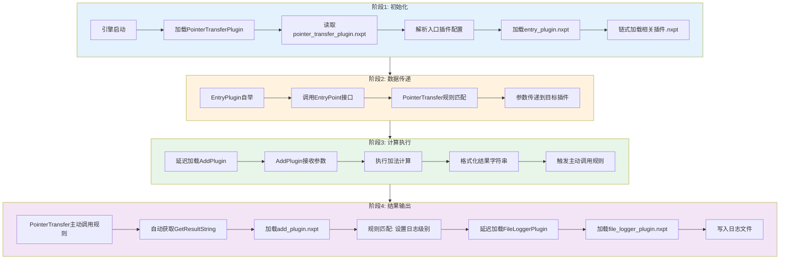
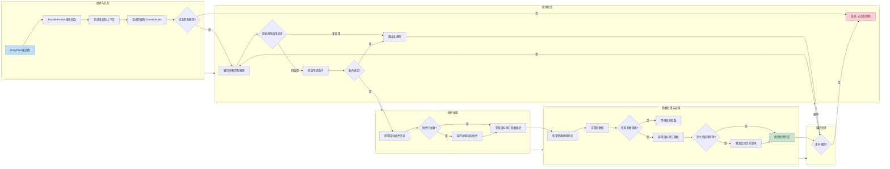
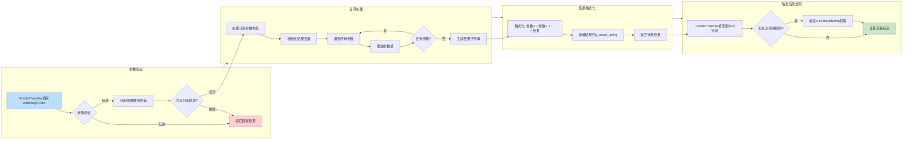
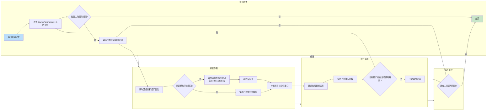
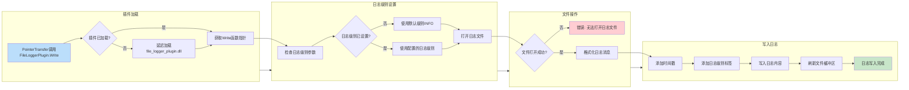
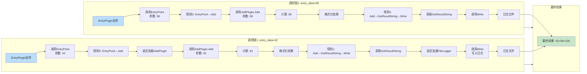

# NXLD引擎运算结构完整流程文档

## 概述

本文档详细描述了NXLD引擎的完整运算流程，包括插件初始化、数据传递、计算执行和结果输出四个主要阶段。

## 流程图

### 主流程图

### 详细流程图1: 初始化阶段

```mermaid
graph LR
    subgraph Init1[启动与配置]
        I1[引擎主程序启动] --> I2[初始化日志系统]
        I2 --> I3[读取NexusEngine.nxld配置]
        I3 --> I4[解析根插件列表]
    end
    
    subgraph Init2[核心插件加载]
        I4 --> I5{找到PointerTransferPlugin?}
        I5 -->|是| I6[加载pointer_transfer_plugin.dll]
        I5 -->|否| I7[错误: 未找到核心插件]
        I6 --> I8[调用nxld_plugin_get_name]
        I8 --> I9[调用nxld_plugin_get_interface_count]
    end
    
    subgraph Init3[规则配置解析]
        I9 --> I10[读取pointer_transfer_plugin.nxpt]
        I10 --> I11[解析TransferRules配置]
        I11 --> I12[查找EntryPlugin配置]
        I12 --> I13[读取entry_plugin.nxpt]
        I13 --> I14[解析EntryPlugin的TransferRules]
    end
    
    subgraph Init4[索引构建]
        I14 --> I15[构建规则索引表]
        I15 --> I16[初始化插件路径缓存]
        I16 --> I17[初始化完成]
    end
    
    Init1 --> Init2
    Init2 --> Init3
    Init3 --> Init4
    
    style I1 fill:#BBDEFB
    style I17 fill:#C8E6C9
    style I7 fill:#FFCDD2
```

### 详细流程图2: EntryPlugin自举流程

```mermaid
graph LR
    subgraph Bootstrap1[DLL加载与初始化]
        E1[EntryPlugin DLL加载] --> E2[DllMain/DLL_PROCESS_ATTACH触发]
        E2 --> E3[调用init_and_start_entry_calls]
        E3 --> E4[获取当前DLL路径]
    end
    
    subgraph Bootstrap2[读取入口配置]
        E4 --> E5[构建entry_plugin.nxin路径]
        E5 --> E6[读取entry_plugin.nxin配置]
        E6 --> E7[解析EntryData节]
        E7 --> E8[加载入口数据项]
    end
    
    subgraph Bootstrap3[加载调度器]
        E8 --> E9[读取核心调度器路径]
        E9 --> E10[加载PointerTransferPlugin]
        E10 --> E11[获取CallPlugin函数指针]
    end
    
    subgraph Bootstrap4[执行入口调用]
        E11 --> E12{遍历所有EntryData项}
        E12 -->|有数据项| E13[调用CallPlugin<br/>EntryPlugin.EntryPoint]
        E12 -->|无数据项| E14[自举完成]
        E13 --> E15[传递entry_data参数]
        E15 --> E12
    end
    
    Bootstrap1 --> Bootstrap2
    Bootstrap2 --> Bootstrap3
    Bootstrap3 --> Bootstrap4
    
    style E1 fill:#BBDEFB
    style E14 fill:#C8E6C9
```

### 详细流程图3: PointerTransfer规则处理流程

### 详细流程图4: AddPlugin计算流程

### 详细流程图5: 主动调用规则触发流程

### 详细流程图6: FileLoggerPlugin日志写入流程

### 详细流程图7: 完整调用链示例

### 详细流程图8: 每条规则详细执行流程

```mermaid
graph LR
    subgraph RuleDetail1[规则匹配]
        R1[接口函数被调用] --> R2[TransferPointer接收调用]
        R2 --> R3[记录调用信息]
        R3 --> R4[在规则索引表中查找匹配规则]
        R4 --> R5{找到匹配规则?}
        R5 -->|否| R6[结束: 无匹配规则]
        R5 -->|是| R7[遍历所有匹配规则]
    end
    
    subgraph RuleDetail2[规则检查]
        R7 --> R8[规则1: 检查规则启用状态]
        R8 --> R9{规则已启用?}
        R9 -->|否| R10[跳过规则1]
        R9 -->|是| R11[检查传递条件Condition]
        R11 --> R12{条件满足?}
        R12 -->|否| R10
        R12 -->|是| R13[检查传递模式Mode]
        R13 --> R14{模式类型}
        R14 -->|unicast| R15[单播]
        R14 -->|broadcast| R16[广播]
        R14 -->|multicast| R17[组播]
    end
    
    subgraph RuleDetail3[插件加载]
        R15 --> R18[获取目标插件信息]
        R16 --> R18
        R17 --> R18
        R18 --> R19[检查目标插件是否已加载]
        R19 --> R20{插件已加载?}
        R20 -->|否| R21[读取.nxpt配置]
        R21 --> R22[加载DLL]
        R22 --> R23[调用get_interface_count]
        R23 --> R24[获取函数指针]
        R20 -->|是| R24
    end
    
    subgraph RuleDetail4[参数处理]
        R24 --> R25[检查SourceParamIndex值]
        R25 --> R26{SourceParamIndex类型}
        R26 -->|>=0| R27[普通规则]
        R26 -->|=-1| R28[主动调用规则]
        R27 --> R29[从源参数中提取值]
        R29 --> R30[检查目标参数就绪状态]
        R30 --> R31[设置目标参数值]
        R31 --> R32{所有参数就绪?}
        R32 -->|否| R33[等待其他参数]
        R32 -->|是| R34[调用目标接口函数]
    end
    
    subgraph RuleDetail5[主动调用处理]
        R28 --> R35[标记为主动调用规则]
        R35 --> R36[等待源接口调用完成]
        R36 --> R37[检查是否需要获取导出接口]
        R37 --> R38{需要导出接口?}
        R38 -->|是| R39[调用导出接口<br/>如GetResultString]
        R38 -->|否| R40[使用已存储的参数值]
        R39 --> R41[获取返回值]
        R41 --> R42[传递返回值到目标接口]
        R40 --> R42
        R42 --> R34
    end
    
    subgraph RuleDetail6[递归与循环]
        R34 --> R43[目标接口调用完成]
        R43 --> R44{目标接口有主动调用规则?}
        R44 -->|是| R45[递归触发主动调用规则]
        R44 -->|否| R46[规则1处理完成]
        R45 --> R7
        R10 --> R47{还有规则?}
        R46 --> R47
        R47 -->|是| R48[处理规则2]
        R47 -->|否| R6
        R48 --> R49[规则2: 检查启用状态]
        R49 --> R50{规则已启用?}
        R50 -->|否| R51[跳过规则2]
        R50 -->|是| R52[执行规则2传递流程]
        R52 --> R53[规则2处理完成]
        R51 --> R54{还有规则?}
        R53 --> R54
        R54 -->|是| R48
        R54 -->|否| R6
    end
    
    RuleDetail1 --> RuleDetail2
    RuleDetail2 --> RuleDetail3
    RuleDetail3 --> RuleDetail4
    RuleDetail4 --> RuleDetail5
    RuleDetail5 --> RuleDetail6
    RuleDetail6 -.->|递归| RuleDetail1
    RuleDetail6 -.->|循环| RuleDetail2
    
    style R1 fill:#BBDEFB
    style R6 fill:#C8E6C9
    style R10 fill:#FFF9C4
    style R51 fill:#FFF9C4
    style R28 fill:#E1BEE7
    style R45 fill:#E1BEE7
```

## 关键组件说明

### 1. PointerTransferPlugin
- **功能**: 核心调度器插件，负责根据.nxpt配置文件规则进行参数传递和插件调用
- **主要接口**:
  - `TransferPointer`: 接收指针参数并根据规则传递
  - `CallPlugin`: 主动调用目标插件接口

### 2. EntryPlugin
- **功能**: 入口插件，在加载时自动启动调用链
- **主要接口**:
  - `EntryPoint`: 入口点接口，接收entry_data参数

### 3. AddPlugin
- **功能**: 加法计算插件，执行整数加法运算
- **主要接口**:
  - `Add`: 执行可变参数加法计算
  - `GetResult`: 获取最后一次计算结果指针
  - `GetResultString`: 获取格式化结果字符串
  - `AddArray`: 使用数组指针执行加法计算

### 4. FileLoggerPlugin
- **功能**: 文件日志插件，将日志信息写入文件
- **主要接口**:
  - `Write`: 写入日志消息

## 配置文件说明

### .nxpt文件格式
- 定义指针传递规则
- 包含源插件、源接口、源参数索引
- 包含目标插件、目标接口、目标参数索引
- 支持主动调用规则（SourceParamIndex=-1）
- 支持传递模式：unicast、broadcast、multicast

### .nxin文件格式
- 定义EntryPlugin的入口数据
- 包含EntryData节，定义多个数据项
- 每个数据项包含Type和Value

## 数据流向

1. **初始化阶段**: 引擎 → PointerTransferPlugin → EntryPlugin配置
2. **自举阶段**: EntryPlugin → PointerTransferPlugin.CallPlugin → EntryPoint
3. **传递阶段**: EntryPoint → PointerTransfer规则 → AddPlugin.Add
4. **计算阶段**: AddPlugin.Add → 计算结果 → GetResultString
5. **输出阶段**: GetResultString → PointerTransfer主动调用 → FileLoggerPlugin.Write

## 延迟加载机制

- 插件采用延迟加载策略，只有在需要调用时才加载
- PointerTransferPlugin维护已加载插件的缓存
- 通过插件路径缓存加速插件查找

## 主动调用规则

- SourceParamIndex=-1表示主动调用规则
- 在源接口调用完成后自动触发
- 可以自动获取导出接口的返回值并传递给目标接口
- 支持链式主动调用，形成调用链

## 错误处理

- 插件加载失败时记录错误日志
- 规则匹配失败时跳过该规则
- 参数验证失败时返回错误结果
- 文件操作失败时返回错误码

